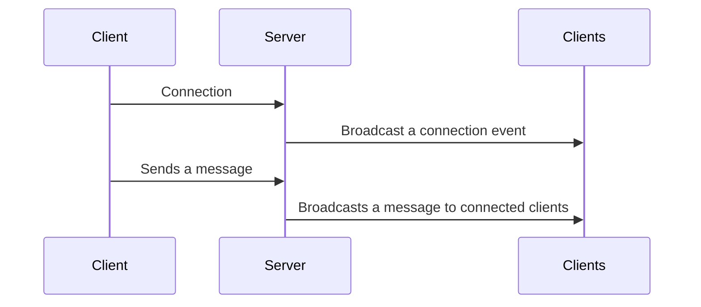
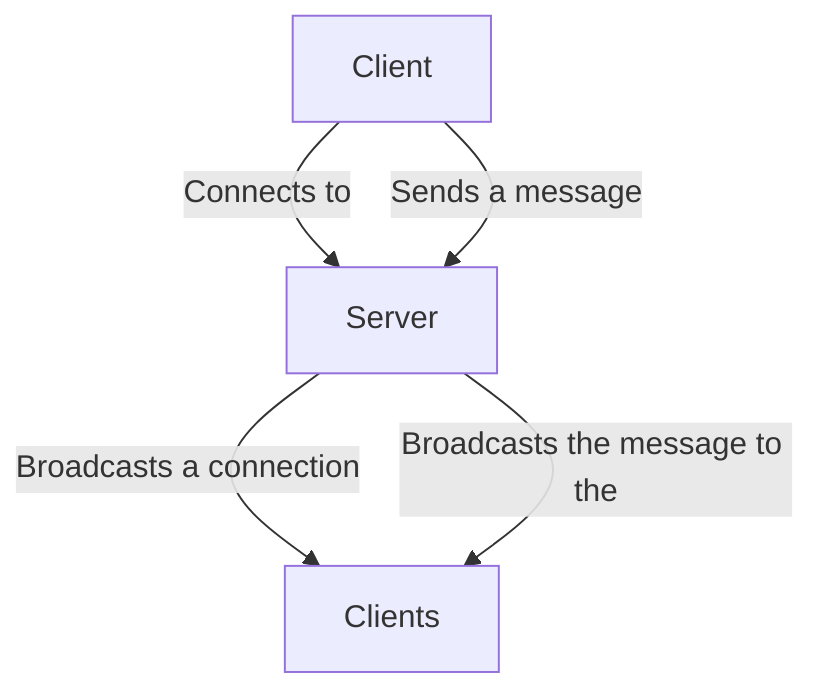

# APS - 5° Semestre

## Chat em tempo real através de conexões de rede (TCP)

O objetivo da APS do 5° semestre é fazer uma aplicação para envio de mensagens em tempo real utilizando os conceitos de protocolos de rede.

### Arquitetura

### Exemplo de aplicação

Chat em tempo real utilizando o módulo `net` do Javascript.

